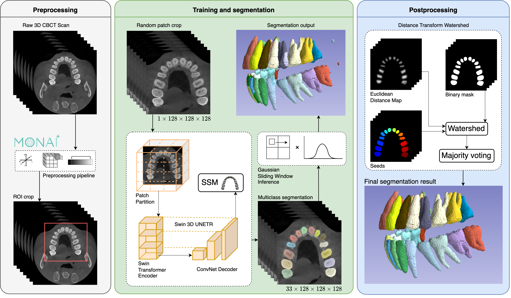
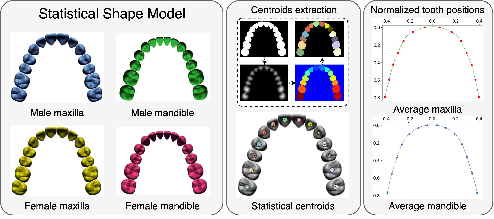

# Tooth Segmentation from CBCT Scans Using Dentition-Based Learning



The repository for Tooth Segmentation from CBCT Scans Using Dentition-Based Learning with SwinUNETR architecture. We provide the training script ToothSwinUNETr/train.py with parameters used for traing stored in ToothSwinUNETR/utils/parser.py. The code used for results calculations is presented in ToothSwinUNETR/utils/inference.py and ToothSwinUNETR/utils/inference_roi.py for global and local methods respectively. Inference scripts leverage proposed watershed-based postprocessing. The proposed dentition-based Wasserstein matrix (M2) is stored in ToothSwinUNETR/losses/wasserstein_matrix_M2.npy, we attach also cross-entropy weights in the same file format (ce_weights.npy). We
calculate M2 matrix based on the dentition statistical shape model by [Kim et al.](https://link.springer.com/article/10.1007/s00784-022-04824-z).



To install dependencies:
```shell
conda create --name <your_env_name> --file requirements.txt
```

We provide pretrained weights of our Dentition-Based model [here](https://drive.google.com/file/d/1CxRugGGtdB8N-gOwEktwyzG9tJQMsP2I).

To run the training code with default parameters (check parser.py for data paths):

```shell
python ToothSwinUNETR/train.py
```

Test dataset and relabelled public training dataset are going to be published: [placeholder].

Directories hierarchy:
```shell
.
├── Figures
│   └── Overview.png
├── README.md
├── ToothSwinUNETR
│   ├── losses
│   │   ├── __init__.py
│   │   ├── ce_weights.npy
│   │   ├── gwdl.py
│   │   ├── loss.py
│   │   ├── wasserstein_matrix_M1.npy
│   │   └── wasserstein_matrix_M2.npy
│   ├── models
│   │   └── swin_unetr.py
│   ├── optimizers
│   │   └── scheduler.py
│   ├── train.py
│   └── utils
│       ├── __init__.py
│       ├── data_augmentation.py
│       ├── dummy_logger.py
│       ├── inference.py
│       ├── inference_roi.py
│       ├── parser.py
│       └── postprocessing.py
├── csv_files
│   └── colormap_slicer.csv
├── environment.yml
├── requirements.txt
└── utilities
    ├── __init__.py
    ├── cuda_stats.py
    ├── log_image.py
    └── slicer_colormap.py
```